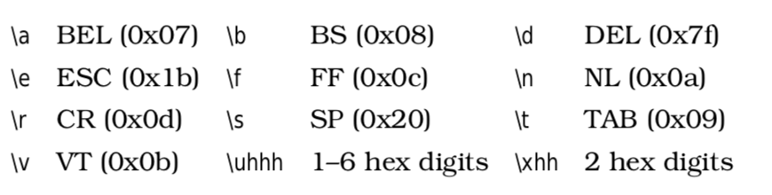

1. **String literals**

Elixir has two kinds of string: single- quoted and double-quoted. They differ significantly in their internal representation, but they also have many things in common.

- Strings can hold characters in UTF-8 encoding

- They may contain escape sequences


- They allow interpolation on Elixir expressions using the syntax #{...}

```elixir
name = "dave"
"Hello, #{String.capitalize(name)}"
```

- They support heredocs
Any string can span several lines. 

```elixir
IO.puts "start"
IO.write "
    my
    string
"
IO.puts "end"
```

Notice how the multiline string retains the leading and trailing newlines and the leading spaces on the intermediate lines.
The heredoc notation fixes this. Triple the string delimiter (''' or """) and indent the trailing delimiter to the same margin as your string contents, and you get this:

```elixir
IO.puts "start"
IO.write """
    my
    string
"""
IO.puts "end"
```

- Sigils

Like Ruby, Elixir has an alternative syntax for some literals. We’ve already seen it with regular expressions, where we wrote ~r{...}. In Elixir, these ~-style literals are called sigils (symbols with magical powers).

A sigil starts with a tilde, followed by an upper- or lowercase letter, some delimited content, and perhaps some options. The delimiters can be <...>, {...}, [...], (...), |...|, /.../, "...", and '...'.

The letter determines the sigil's type:

~C A character list with no escaping or interpolation

~c A character list, escaped and interpolated just like a single-quoted string 

~D A Date in the format yyyy-mm-dd

~N A naive (raw) DateTime in the format yyyy-mm-dd hh:mm:ss[.ddd]

~R A regular expression with no escaping or interpolation

~r A regular expression, escaped and interpolated

~S A string with no escaping or interpolation

~s A string, escaped and interpolated just like a double-quoted string

~T A Time in the format hh:mm:ss[.dddd]

~W A list of whitespace-delimited words, with no escaping or interpolation ~w A list of whitespace-delimited words, with escaping and interpolation

```elixir
~C[1\n2#{1+2}]
~c"1\n2#{1+2}"
~S[1\n2#{1+2}]
~s[1\n2#{1+2}]
~W[the c#{'a'}t sat on the mat]
~w[the c#{'a'}t sat on the mat]
~D<1999-12-31>
~T[12:34:56]
~N{1999-12-31 23:59:59}
```

The ~W and ~w sigils take an optional type specifier, a, c, or s, which determines whether it returns a list of atoms, character lists, or strings. (We’ve already seen the ~r options.)

```elixir
~w[the c#{'a'}t sat on the mat]a
~w[the c#{'a'}t sat on the mat]c
~w[the c#{'a'}t sat on the mat]s
```

The delimiter can be any nonword character. If it is (, [, {, or <, then the ter- minating delimiter is the corresponding closing character. Otherwise the ter- minating delimiter is the next nonescaped occurrence of the opening delimiter.
Elixir does not check the nesting of delimiters, so the sigil ~s{a{b} is the three- character string a{b.
If the opening delimiter is three single or three double quotes, the sigil is treated as a heredoc.

```elixir
~w"""
the
cat
sat
"""
```

2. **The name "Strings"**

In Elixir, the convention is that we call only double-quoted strings “strings.” The single-quoted form is a character list.
This is important. The single- and double-quoted forms are very different, and libraries that work on strings work only on the double-quoted form.

3. **Single-quoted strings**

Single-quoted strings are represented as a list of integer values, each value corresponding to a codepoint in the string. For this reason, we refer to them as character lists (or char lists).

```elixir
str = 'wombat'
is_list(str)
length str
Enum.reverse str
```
This is confusing: IEx says it is a list, but it shows the value as a string. That’s because IEx prints a list of integers as a string if it believes each number in the list is a printable character.

```elixir
[ 67, 65, 84 ]
```

You can look at the internal 
representation in a number of ways:

```elixir
str = 'wombat'
:io.format "~w~n", [ str ]
List.to_tuple(str)
str ++ [0]
```

Because a character list is a list, we can use the usual pattern matching and List functions.

```elixir
'pole' ++ 'vault'
'pole' -- 'vault'
List.zip [ 'abc', '123' ]
[ head | tail ] = 'cat'
head
tail
[ head | tail ]
```

4. **Binaries**

The binary type represents a sequence of bits. A binary literal looks like << term,... >>.
The simplest term is just a number from 0 to 255. The numbers are stored as successive bytes in the binary.


```elixir
b = << 1, 2, 3 >>
byte_size b
bit_size b
```

You can store integers, floats, and other binaries in binaries.

```elixir
int = << 1 >>
float = << 2.5 :: float >>
mix = << int :: binary, float :: binary >>
```

5. **Couble-quoted strings are binaries**

Whereas single-quoted strings are stored as char lists, the contents of a double-quoted string (dqs) are stored as a consecutive sequence of bytes in UTF-8 encoding. Clearly this is more efficient in terms of memory and certain forms of access, but it does have two implications.
First, because UTF-8 characters can take more than a single byte to represent, the size of the binary is not necessarily the length of the string.

```elixir
dqs = "∂x/∂y"
String.length dqs
byte_size dqs
String.at(dqs, 0)
String.codepoints(dqs)
String.split(dqs, "/")
```

- **Strings and Elixir Libraries**

When Elixir library documentation uses the word string (and most of the time it uses the word binary), it means double-quoted strings.
The String module defines functions that work with double-quoted strings.

- at(str, offset)
```elixir
String.at("∂og", -1)
```

- capitalize(str)
```elixir
String.capitalize "école"
```

- codepoints(str)
```elixir
String.codepoints("José's ∂øg")
```

- downcase(str)
```elixir
String.downcase "ØRSteD"
```

- duplicate(str, n)
```elixir
String.duplicate "Ho! ", 3
```

- ends_with?(str, suffix | [ suffixes ])
```elixir
String.ends_with? "string", ["elix", "stri", "ring"]
```

- first(str)
```elixir
String.first "∂og"
```

- graphemes(str)
```elixir
String.codepoints "noe\u0308l"
String.graphemes "noe\u0308l"
```

- jaro_distance
```elixir
String.jaro_distance("jonathan", "jonathon")
String.jaro_distance("josé", "john")
```

- last(str)
```elixir
String.last "∂og"
```

- length(str)
```elixir
String.length "∂x/∂y"
```

- myers_difference 
```elixir
String.myers_difference("banana", "panama")
```

- next_codepoint(str)
```elixir

defmodule MyString do
    def each(str, func), do: _each(String.next_codepoint(str), func)
    defp _each({codepoint, rest}, func) do 
        func.(codepoint)
         _each(String.next_codepoint(rest), func)
    end
    defp _each(nil, _), do: [] end

MyString.each "∂og", fn c -> IO.puts c end
```

- next_grapheme(str)

Same as next_codepoint, but returns graphemes (:no_grapheme on completion).

- pad_leading(str, new_length, padding \\ " ")
```elixir
String.pad_leading("cat", 5, ">")
```

- pad_trailing(str, new_length, padding \\ " ")
```elixir
String.pad_trailing("cat", 5)
```

- printable?(str)
```elixir
String.printable? "José"
String.printable? "\x00 a null"
```

- replace(str, pattern, replacement, options \\ [global: true, insert_replaced: nil])
```elixir
String.replace "the cat on the mat", "at", "AT"
String.replace "the cat on the mat", "at", "AT", global: false
String.replace "the cat on the mat", "at", "AT", insert_replaced: 0
String.replace "the cat on the mat", "at", "AT", insert_replaced: [0,2]
```

- reverse(str)
```elixir
String.reverse "pupils"
String.reverse "∑ƒ÷∂"
```

- slice(str, offset, len)
```elixir
String.slice "the cat on the mat", 4, 3
String.slice "the cat on the mat", -3, 3
```

- split(str, pattern \\ nil, options \\ [global: true])
```elixir
String.split " the cat on the mat "
String.split "the cat on the mat", "t"
String.split "the cat on the mat", ~r{[ae]}
String.split "the cat on the mat", ~r{[ae]}, parts: 2
```

- starts_with?(str, prefix | [ prefixes ])
```elixir
String.starts_with? "string", ["elix", "stri", "ring"]
```

- trim(str)
```elixir
String.trim "\t Hello \r\n"
```

- trim(str, character)
```elixir
String.trim "!!!SALE!!!", "!"
```

- trim_leading(str)
```elixir
String.trim_leading "\t\f Hello\t\n"
```

- trim_leading(str, character)
```elixir
String.trim_leading "!!!SALE!!!", "!"
```

- trim_trailing(str)
```elixir
String.trim_trailing(" line \r\n")
```

- trim_trailing(str, character)
```elixir
String.trim_trailing "!!!SALE!!!", "!"
```

- upcase(str)
```elixir
String.upcase "José Ørstüd"
```

- valid?(str)
```elixir
String.valid? "∂"
String.valid? "∂og"
String.valid? << 0x80, 0x81 >>
```

6. **Binaries and pattern matching**

-**String Processing with Binaries**

When we process lists, we use patterns that split the head from the rest of the list. With binaries that hold strings, we can do the same kind of trick. We have to specify the type of the head (UTF-8), and make sure the tail remains a binary.

```elixir
defmodule Utf8 do
    def each(str, func) when is_binary(str), do: _each(str, func)
    defp _each(<< head :: utf8, tail :: binary >>, func) do 
        func.(head)
        _each(tail, func)
    end
    defp _each(<<>>, _func), do: [] 
end

Utf8.each "∂og", fn char -> IO.puts char end
```

