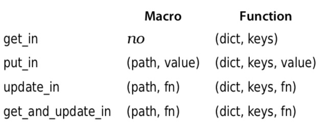

-**How to choose between maps, structs and keyword lists**

A dictionary is a data type that associates keys with values. The hardest thing is to choose an appropriate dictionary type fora particular need. 

Ask yourself these questions (in this order):
    
    • Do I want to pattern-match against the contents (for example, matching a dictionary that has a key of :name somewhere in it)?

`If so, use a map.`

    • Will I want more than one entry with the same key?

`If so, you’ll have to use the Keyword module.`

    • Do I need to guarantee the elements are ordered?

`If so, again, use the Keyword module.`

    • Do I have a fixed set of fields (that is, is the structure of the data always the same)?
`If so, use a struct.`

    • Otherwise, if you’ve reached this point

`Use a map.`

-**Maps, keyword lists, sets and structs**

1. **Keyword lists**
    - ordered 
    - list of tuple
    - first element in tuple is always an atom
    - [key_atom : value]
    - `all`, `at`and Access.pop access modules

For simple access, you can use the access operator, kwlist[key]. In addition, all the functions of the Keyword and Enum modules are available.

```elixir
defmodule Canvas do
@defaults [ fg: "black", bg: "white", font: "Merriweather" ]

def draw_text(text, options \\ []) do
    options = Keyword.merge(@defaults, options)
    IO.puts "Drawing text   #{inspect(text)}"
    IO.puts "Foreground:    #{options[:fg]}"
    IO.puts "Background:    #{Keyword.get(options, :bg)}"
    IO.puts "Font:          #{Keyword.get(options, :font)}"
    IO.puts "Pattern:       #{Keyword.get(options, :pattern, "solid")}"
    IO.puts "Style:         #{inspect Keyword.get_values(options, :style)}"
    end 
end

Canvas.draw_text("hello", fg: "red", style: "italic", style: "bold")

```

2. **Maps**
    - unordered 
    - dict with key: value
    - key is whatever we wants
    - %{key: value}
    - `key`, `key!` and Access.pop access modules

Maps are the go-to key/value data structure in Elixir. They have good perfor- mance at all sizes.

```elixir
map = %{ name: "Dave", likes: "Programming", where: "Dallas" }
Map.keys map
Map.values map
map[:name]
map.name
map1 = Map.drop map, [:where, :likes]
map2 = Map.put map, :also_likes, "Ruby"
Map.keys map2
Map.has_key? map1, :where
{ value, updated_map } = Map.pop map2, :also_likes
Map.equal? map, updated_map
```

**Pattern matching** 

```elixir
person = %{ name: "Dave", height: 1.88 }
%{ name: a_name } = person 
a_name
%{ name: _, height: _ } = person
%{ name: "Dave" } = person
%{ name: _, weight: _ } = person        # error
```

Now, let's use more data.
```elixir

people = [
%{ name: "Grumpy", height: 1.16},
%{ name: "Dave", height: 1.76},
%{ name: "Dopey", height: 1.96},
%{ name: "Shaquille", height: 2.16 }, 
%{ name: "Sneezy", height: 1.28 }
]

IO.inspect(for person = %{ height: height } <- people, height > 1.5, do: person)
```

```elixir
defmodule HotelRoom do
    def book(%{name: name, height: height}) 
    when height > 1.9 do
        IO.puts "Need extra-long bed for #{name}" 
    end
    def book(%{name: name, height: height}) 
    when height < 1.3 do
        IO.puts "Need low shower controls for #{name}" 
    end
    def book(person) do
        IO.puts "Need regular bed for #{person.name}"
    end 
end

people |> Enum.each(&HotelRoom.book/1)
```

We need to keep in mind that we can use pattern matching with value, but not with key

```elixir
<!-- OK -->
%{ 2 => state } = %{ 1 => :ok, 2 => :error }
state

<!-- THIS IS WRONG -->
%{ item => :ok } = %{ 1 => :ok, 2 => :error }

<!-- OK -->
data = %{ name: "Dave", state: "TX", likes: "Elixir" }
for key <- [ :name, :likes ] do
    %{ ^key => value } = data
    value
end
```
**Updating maps**

As with all values in Elixir, a map is immutable, and so the result of the update is a new map.
The simplest way to update a map is with this syntax:
`new_map = %{ old_map | key => value, ... }`

```elixir
m = %{ a: 1, b: 2, c: 3 }
m1 = %{ m | b: "two", c: "three" }
m2 = %{ m1 | a: "one" }
```
However, this syntax will not add a new key to a map. To do this, you have to use the Map.put_new/3 function.

3. **Structs**
    - fixed set of fields with default values for those fields 
    - dict with key: value
    - key need to be an atom
    - %Struct{key_atom: value}
    - `key` and `key!` access modules

If we want to create a typed map — a map that has a fixed set of fields and default values for those fields, and that you can pattern-match by type as well as content.
A struct is just a module that wraps a limited form of map. It’s limited because the keys must be atoms and because these maps don’t have Dict capabilities. The name of the module becomes the name of the map type.

```elixir
defmodule Subscriber do
    defstruct name: "", paid: false, over_18: true
end

s1 = %Subscriber{}
s2 = %Subscriber{ name: "Dave" }
s3 = %Subscriber{ name: "Mary", paid: true }
```

You access the fields in a struct using dot notation or pattern matching:
```elixir
s3.name
%Subscriber{name: a_name} = s3
a_name
s4 = %Subscriber{ s3 | name: "Marie"}
```

Why are structs wrapped in a module? The idea is that you are likely to want to add struct-specific behavior.

```elixir
defmodule Attendee do
    defstruct name: "", paid: false, over_18: true

    def may_attend_after_party(attendee = %Attendee{}) do 
        attendee.paid && attendee.over_18
    end
    def print_vip_badge(%Attendee{name: name}) when name != "" do 
        IO.puts "Very cheap badge for #{name}"
    end
    def print_vip_badge(%Attendee{}) do 
        raise "missing name for badge"
    end 
end

a1 = %Attendee{name: "Dave", over_18: true}
Attendee.may_attend_after_party(a1)
a2 = %Attendee{a1 | paid: true}
Attendee.may_attend_after_party(a2)
Attendee.print_vip_badge(a2)
a3 = %Attendee{}
Attendee.print_vip_badge(a3)
```
Structs also play a large role when implementing polymorphism.

4. **Nested dictinary structures**

The various dictionary types let us associate keys with values. But those values can themselves be dictionaries.

```elixir
defmodule Customer do
    defstruct name: "", company: ""
end
defmodule BugReport do
    defstruct owner: %Customer{}, details: "", severity: 1
end

report = %BugReport{owner: %Customer{name: "Dave", company: "Pragmatic"}, details: "broken"}
report.owner.company

# hard way of updating
report = %BugReport{ report | owner: %Customer{ report.owner | company: "PragProg" }}

# easier way of updating
put_in(report.owner.company, "PragProg")
update_in(report.owner.name, &("Mr. " <> &1))
```

```elixir
my_map = %{
  bob: %{
    age: 36
  }
}

my_map = update_in(my_map, [:bob, :age], &(&1 + 1))
#=> %{bob: %{age: 37}}

my_map = update_in(my_map.bob.age, &(&1 + 1))
#=> %{bob: %{age: 37}}

my_map = put_in(my_map, [:bob, :age], 40)

get_in(my_map, [:bob, :age]) == 36
#=> false

my_map = get_and_update_in(my_map, [:bob, :age],  &{&1, &1 * 2})
#=> {40, %{bob: %{age: 80}}}
```

**Nested Accessors and Nonstructs**

If you are using the nested accessor functions with maps or keyword lists, you can supply the keys as atoms:

```elixir
report = %{ owner: %{ name: "Dave", company: "Pragmatic" }, severity: 1}
put_in(report[:owner][:company], "PragProg")
update_in(report[:owner][:name], &("Mr. " <> &1))
```

**Dynamic (Runtime) Nested Accessors**

The nested accessors we’ve seen so far are macros—they operate at compile time. As a result, they have some limitations:

• The number of keys you pass a particular call is static.

• You can’t pass the set of keys as parameters between functions.
These are a natural consequence of the way the macros bake their parameters into code at compile time.

To overcome this, get_in, put_in, update_in, and get_and_update_in can all take a list of keys as a separate parameter. Adding this parameter changes them from macros to function calls, so they become dynamic.



```elixir
nested = %{ 
    buttercup: %{
        actor: %{
            first: "Robin", 
            last: "Wright"
        },
        role: "princess"
    },
    westley: %{
        actor: %{
            first: "Cary", 
            last: "Elwes"
        },
        role: "farm boy"
    } 
}

IO.inspect get_in(nested, [:buttercup])

IO.inspect get_in(nested, [:buttercup, :actor])

IO.inspect get_in(nested, [:buttercup, :actor, :first])

IO.inspect put_in(nested, [:westley, :actor, :last], "Wright")
```

```elixir
authors = [
%{ name: "José", language: "Elixir" }, 
%{ name: "Matz", language: "Ruby" }, 
%{ name: "Larry", language: "Perl" }
]

languages_with_an_r = fn (:get, collection, next_fn) -> 
    for row <- collection do
        if String.contains?(row.language, "r") do 
            next_fn.(row)
        end 
    end
end

IO.inspect get_in(authors, [languages_with_an_r, :name])
```
**The Access Module**

The Access module provides a number of predefined functions to use as parameters to get and get_and_update_in. These functions act as simple filters while traversing the structures.

The `all` and `at` functions only work on **lists**. all returns all elements in the list, while at returns the nth element **(counting from zero)**.

```elixir
cast = [ 
    %{
        character: "Buttercup", 
        actor: %{
            first: "Robin",
            last:  "Wright"
        },
        role: "princess"
    }, 
    %{
        character: "Westley", 
        actor: %{
            first: "Cary",
            last:  "Elwes"
        },
        role: "farm boy"
    } 
]

IO.inspect get_in(cast, [Access.all(), :character])

IO.inspect get_in(cast, [Access.at(1), :role])

IO.inspect get_and_update_in(cast, [Access.all(), :actor, :last], fn (val) -> {val, String.upcase(val)} end)
```

The `elem` function works on **tuples**:

```elixir
cast = [ 
    %{
        character: "Buttercup",
        actor: {"Robin", "WRIGHT"},
       role: "princess"
    },
    %{
        character: "Westley", 
        actor: {"Cary", "Elwes"},
        role: "farm boy"
    }
]

IO.inspect get_in(cast, [Access.all(), :actor, Access.elem(1)])

IO.inspect get_and_update_in(cast, [Access.all(), :actor, Access.elem(1)], fn (val) -> {val, String.reverse(val)} end)
```

The `key` and `key!` functions work on dictionary types (**maps** and **structs**):

```elixir
cast = [ 
    buttercup: %{
        actor: {"Robin", "WRIGHT"},
        role: "princess"
    },
    westley: %{
        actor: {"Cary", "Elwes"},
        role: "farm boy"
    }
]

IO.inspect get_in(cast, [Access.key(:westley), :actor, Access.elem(1)])

IO.inspect get_and_update_in(cast, [Access.key(:buttercup), :role], fn (val) -> {val, "Queen"} end)
```

Finally, Access.pop lets you remove the entry with a given key from a map or keyword list. It returns a tuple containing the value associated with the key and the updated container. nil is returned for the value if the key isn’t in the container.
`The name has nothing to do with the pop stack operation.`

```elixir
Access.pop(%{name: "Elixir", creator: "Valim"}, :name)
Access.pop([name: "Elixir", creator: "Valim"], :name)
Access.pop(%{name: "Elixir", creator: "Valim"}, :year)
```
5. **Sets**
    - logarithmic time complexity
    - any kind of elements
    - elements can be different type
    - can't contain duplicate elements

A set can contain any kind of elements, and elements in a set don't have to be of the same type. By definition, sets can't contain duplicate elements: when inserting an element in a set where it's already present, the insertion is simply a no-op.
A MapSet is represented internally using the %MapSet{} struct. This struct can be used whenever there's a need to pattern match on something being a MapSet:

```elixir
match?(%MapSet{}, MapSet.new())
```

MapSets can also be constructed starting from other collection-type data structures: for example, see MapSet.new/1 or Enum.into/2.

MapSet is built on top of Map, this means that they share many properties, including logarithmic time complexity. 

```elixir
set1 = 1..5 |> Enum.into(MapSet.new) 
set2 = 3..8 |> Enum.into(MapSet.new) 
MapSet.member? set1, 3
MapSet.union set1, set2 
MapSet.difference set1, set2 MapSet.difference set2, set1 
MapSet.intersection set2, set1 
```